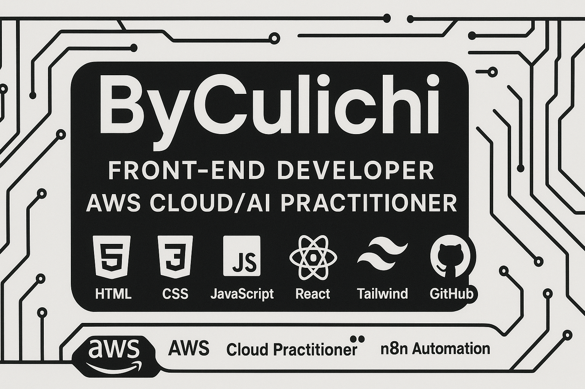

---

  

<h1 align="center">Hello! 🫡 I'm Christian Velasco</h1>

  🚀 Frontend Developer · ☁️ Certified AWS Cloud Practitioner · 🤖 AI Automation
  

---

## 🐍 Contribution Snake
<picture>
  <source media="(prefers-color-scheme: dark)" srcset="https://raw.githubusercontent.com/obregonia1/obregonia1/master/img/snake-dark.svg">
  <source media="(prefers-color-scheme: light)" srcset="https://raw.githubusercontent.com/obregonia1/obregonia1/master/img/snake.svg">
  
</picture>

---

## 🎯 What I'm focusing on
- Boosting performance (Core Web Vitals) in Next.js/React
- Integrating CI/CD pipelines with GitHub Actions
- Automating workflows with Node.js/Python

## 👨‍💻 About Me &  Value Proposition

I'm Christian Velasco, a passionate Frontend Developer in progress, currently studying Software Development and working at Tata Consultancy Services. My main focus is building scalable, user-friendly web applications using modern technologies.

I build modern, accessible, and fast web applications with React/Next.js, optimized for SEO and designed to scale on AWS/. I care about developer experience, performance (Core Web Vitals), and responsive design to ship production-ready products.

- 🚀 Learning and building with **React**, **Next.js**, **Tailwind CSS**, and cloud platforms for deployment.
- ☁️ Exploring cloud platforms like **AWS** for scalable solutions.
- 💡 Enthusiastic about continuous learning and new technologies.
- 🐍 Experimenting with **Node.js** and **Python** for backend development and workflow automation.
- 🌎 Open to remote and hybrid opportunities worldwide.

---

## 🧰 Tech Stack

  

- Frontend: HTML, CSS, JavaScript/TypeScript, React, Next.js, Tailwind CSS
- Tooling: ESLint, Prettier, Vitest/Jest, React Testing Library
- DevOps: Docker, GitHub Actions, deployments to AWS/Static hosting
- Accessibility & SEO: Lighthouse, Core Web Vitals, ARIA

**Frontend**  
💻 
🎨 
⚡ 
⚛️ 
⚡ 
🌬️ 

**Backend & Automation**  
🟢 
🐍 
🤖 

**Cloud & DevOps**  
☁️ 
🐳 
🔧 
🐙 

---

## 📂 Featured Projects

| Project                  | Description                                                                                                                                   | Technologies Used                                       | Demo |
|--------------------------|-----------------------------------------------------------------------------------------------------------------------------------------------|---------------------------------------------------------|------|
| **Calculator-Culichi**   | A simple yet effective calculator application implementing core arithmetic operations, built for practicing JavaScript logic and version control workflows. | JavaScript, HTML, CSS, Git                              |  |
| **Todo-App-Culichi**     | An intuitive task management tool that lets users add, complete, and delete tasks, focusing on user experience and responsive UI design.               | JavaScript, HTML, CSS, Local Storage                    |  |
| **Portfolio-Culichi**    | My personal portfolio showcasing my skills, projects, and work experience through a clean and interactive interface.                                   | JavaScript, HTML, CSS, Responsive Design                |  |
| **WeatherApp-Culichi**   | A weather application that fetches real-time weather data from a public API, displaying forecasts with a dynamic and user-friendly interface.          | JavaScript, HTML, CSS, REST API, Fetch API              |  |

> ⭐ Check each repository for technical details, documentation, and source code.

---

## 📊 GitHub Stats

  
  
  

---

# 💻 My favorite tools and technologies

<table align="center">
  <tr>
    <td align="center" width="96">
        
       React
    </td>
    <td align="center" width="96">
      
       Python
    </td>
    <td align="center" width="96">
        
       JavaScript
    </td>
    <td align="center" width="96">
        
       MySQL
    </td>
    <td align="center" width="96">
        
       TypeScript
    </td>
    <td align="center" width="96">
        
       AWS
    </td>
  </tr>
  <tr>
    <td align="center" width="96">
        
       Github
    </td>
    <td align="center" width="96"> 
        
       Git
    </td>
    <td align="center"  width="96">
        
       HTML5
    </td>
    <td align="center" width="96">
        
       CSS
    </td>
    <td align="center" width="96">
        
       Tailwind
    </td>
        <td align="center" width="96">
        
       Nodejs
      </td>
 </tr>
</table>
  

---

## 📫 Let's Connect!

  
  
  

---

> ✨ **Thanks for stopping by!**  
> Your feedback and connection are always welcome. Explore my projects and let’s build the future of web together! 🚀🌎

