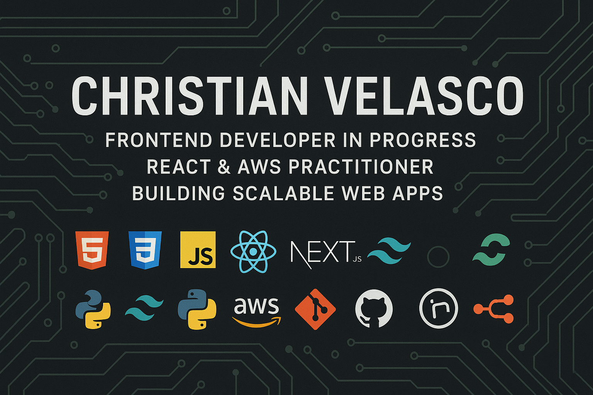

# 👋 Hello! I'm Christian Velasco

### 🚀 Frontend Developer | AWS Cloud/IA Practitioner | IA Automation

---

## 👨‍💻 About Me

I'm Christian Velasco, a passionate Frontend Developer in progress, currently studying Software Development and working at Tata Consultancy Services. My main focus is building scalable, user-friendly web applications using modern technologies.

- 🚀 Learning and building with **React**, **Tailwind CSS**, and **AWS** for cloud deployment.
- ☁️ Exploring cloud platforms like **AWS** and **Google Cloud** for scalable solutions.
- 💡 Enthusiastic about continuous learning and new technologies.
- 🐍 Experimenting with **Python** and workflow automation using n8n.
- 🌎 Open to remote and hybrid opportunities worldwide.
- 🎯 My goal: Secure a Junior Developer role by 2026 and contribute to impactful projects.

---

## 🛠️ Tech Stack

**Frontend**  
💻 
🎨 
⚡ 
⚛️ 
🌬️ 

**Backend & Automation**  
🐍 
🤖 

**Cloud & DevOps**  
☁️ 
🔧 
🐙 

---

## 📂 Featured Projects

| Project                  | Description                                                                                                                                   | Technologies Used                                       | Demo |
|--------------------------|-----------------------------------------------------------------------------------------------------------------------------------------------|---------------------------------------------------------|------|
| **Calculator-Culichi**   | A simple yet effective calculator application implementing core arithmetic operations, built for practicing JavaScript logic and version control workflows. | JavaScript, HTML, CSS, Git                              |  |
| **Todo-App-Culichi**     | An intuitive task management tool that lets users add, complete, and delete tasks, focusing on user experience and responsive UI design.               | JavaScript, HTML, CSS, Local Storage                    |  |
| **Portfolio-Culichi**    | My personal portfolio showcasing my skills, projects, and work experience through a clean and interactive interface.                                   | JavaScript, HTML, CSS, Responsive Design                |  |
| **WeatherApp-Culichi**   | A weather application that fetches real-time weather data from a public API, displaying forecasts with a dynamic and user-friendly interface.          | JavaScript, HTML, CSS, REST API, Fetch API              |  |

> ⭐ Check each repository for technical details, documentation, and source code.

---

## 📊 GitHub Stats

---

## 📫 Let's Connect!

  
  
  

---

✨ **Thanks for stopping by!**  
Your feedback and connection are always welcome. Check out my projects and let’s build the future of web together! 🚀🌎
